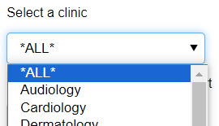
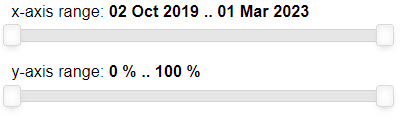
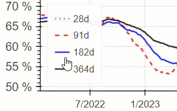
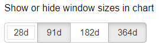

< [Portfolio](https://907sjl.github.io) | [GitHub Repository](https://github.com/907sjl/moving-rates-bokeh)    

## Quick Start
Create a virtual environment from the requirements.txt file and start the built-in Bokeh application server from the Python program file.    
```    
usage: venv\Scripts\bokeh serve --show moving-process-rates.py    
```    

## Background
One way to measure access to care is timeliness. Long delays to see a healthcare provider can speak to availability issues, either a lack of resources or inefficiencies that result in a less than optimal conversion of referrals into appointments. Long delays can also speak to accommodation issues or accessibility issues if patients have difficulty attending their scheduled appointments.
This project is an example of visualizing moving process rates using the sample data for [this example report](https://907sjl.github.io/referrals-bokeh/) of referral process timings for specialty clinics.    

Moving rates work well for ambulatory clinics, especially when the volume of visits is sometimes low or not consistent. Rates of process completion are already an average and so the moving rate approach 
avoids calculating an average of an average with across inconsistent denominators such as the number of visits in a day or other period.    

## Technology Stack
This is a simple Bokeh app compared to the report example. It creates a few visuals and widgets with data but relies on Bokeh's built-in application server features 
to create the HTML layout and serve the application.    

    

These technologies are used by application layers that manage the data model, application content, and data visualization.    

    

### Python and Pandas    
Flexibility and freedom also define another technology underlying this example, Python. Python is a general purpose programming language used to create 
complex applications, to be the glue that integrates other software platforms, or to automate tasks with scripts. Using Python to create your analytic 
deliverable ensures that you will have opportunities to automate tasks such as data refresh and report generation. BI tools limit your automation possibilities to 
predetermined use cases. A report or dashboard developed using Python can be automated using Python. There are few licensing concerns with Python itself 
and no paid subscriptions necessary.    

Pandas is a data analysis library for Python programs. It provides data aggregation, statistical analysis, and data manipulation within the Python framework. 
Using Python and Pandas together frees you from the limitations of software packages. You may sacrifice 
the convenience of connectors for specific data sources, depending on the availability of Python libraries for the data that you have. A custom program 
written in Python and using Pandas can be more elegant, efficient, and configurable than data pipelines created in commercial software tools.    

### Bokeh    
Bokeh provides data visualization and data interaction capabilities to the Python platform, using either notebooks or standalone programs. This example is a 
standalone program written in Python that uses the Bokeh library along with Pandas. A program uses Bokeh to dynamically place glyphs and widgets on 
the canvas of a plot using data sets. The placement, size, color, shape, and number of glyphs is totally within your control. This is 
in contrast to commercial BI tools with a set palette of visuals that you can easily drop onto a page-formatted canvas. BI tools limit you to the visuals 
and options that they have built in order to provide speed and convenience.    

Other Python libraries provide similar but Bokeh also has one aspect to its architecture that is compelling. Bokeh uses websockets to open a network 
connection to the server program from the web browser that is rending the visuals. All data and configurations for those visuals are channeled through 
that websocket instead of being downloaded as text content in the HTML page. The data isn't stored in a browser cache. It can't be captured from the 
page source. A JavaScript library programmatically renders the visuals after the websocket is open. Even better, that library automatically updates 
the visuals without reloading the page when the data is changed, or in response to an interaction with the person viewing. Bokeh provides interactivity 
through the browser.    

### HTML, JavaScript, and CSS    
Bokeh leverages these common and pervasive technologies to enable customizable layouts with data visualizations and interactive widgets. 
HTML provides the scaffolding while CSS shapes and styles the layout. JavaScript facilitates the communication between the application server and the 
client browser.    

## Application Overview    
This Bokeh application visualizes the moving rates that clinics see referrals within 30 days. Rates are calculated across window sizes of 28 days, 91 days, 182 days, 
and 364 days. Each window is a multiple of seven days to fit the weekly cadence of an ambulatory clinic. Having differing numbers of Sundays in the denominator 
of the rate calculation across time introduces extra noise and defeats the smoothing effect of a moving rate.    

    

The volume of referrals that are included in the rates is visualized under the moving rate chart as both a moving total and a daily total. The three charts have 
synchronized x-axis ranges so that the volumes always line up under the corresponding rate. Hovering over any of the charts displays a vertical line across all 
three charts to help the viewer visually follow the data across the charts. A tooltip box with the actual y-axis values follows the mouse.    

Viewers can interact with the charts by using the standard Bokeh tools to pan or zoom. As one chart is explored this way, the other charts automatically align 
their x-axis with it.    

A drop-down box to the right of the charts allows one clinic to be selected. The default is an aggregated rate for all clinics as one organization. When a clinic 
is selected the charts are filtered, updated, and the y-axis adjusted to fit the new range.    

Underneath the clinic drop-down is a group of toggle buttons with one button for each moving window size. These buttons will toggle the line for that window on 
and off. Similarly, click on an entry in the legend for the top chart of moving rates to mute the color of the corresponding line.    

Slider controls allow for fine tuning of the x-axis or y-axis ranges after a zoom.    

## Data Sources
The numerical values in these reports are fabricated and do not represent any real healthcare organization.  The script that created the data for this 
example can be found [in this repository folder](https://github.com/907sjl/referrals_powerbi/tree/main/create_referral_data). This script creates a 
Comma Separated Values file that is the source of data for this report. The **Referrals.csv** file loads records of referrals and processing dates.    
   
    
This source file contains a horizontal list of columns representing the dates that each referral first reached processing milestones such as the date written, date sent, accepted, scheduled, and seen. 
These dates are used by transformations to calculate process timings.    

## Program Structure    
This program is created to work in conjunction with the built-in Bokeh server. The top-level code in this program is invoked by an application 
handler that responds to HTTP requests for the application. This results in the top-level code not truly acting as top-level code but rather it 
executes each time the application page is requested. In a Bokeh app, this only happens once per session. The interactions take place over a websocket 
between the client browser and the server.    

    

This isn't ideal for the loading and transformation of the data. The data load and transform could be placed into a module. Python module imports happen once 
and are then cached. In this example the data is loaded and processed with each new session.    

    

A single session should remain resident in memory with an open connection until the client browser closes the page or navigates away from the Bokeh application. 
This allows events to be sent back to the application when the charts are interacted with using the Bokeh tools, or when the viewer makes a selection using 
one of the custom widgets on the page. The application then sends visualization updates back to the client browser to be rendered by the BokehJS scripts.    

## Pandas ELT    

### Data Load    
The data load is initiated by the top-level code that is executed by the Bokeh application handler in response to the initial HTTP request for the application. 
Python functions in this program load the referral data and calculate moving rates. This data remains resident in memory as long as the session is alive.    

The **load_data()** function loads the source data from a CSV file. The CSV file is loaded directly into Pandas DataFrame objects with typecasting.    

```
df = pd.read_csv(file_path, header=0, dtype=columns)
# This seems to work better than asking read_csv to convert datetime columns
df[date_columns] = df[date_columns].apply(pd.to_datetime)
return df
```    

The data is then passed along to functions that calculate simple record-level facts and then derivative measures across different moving windows.    

### Record Level Transforms    
The **process_record_transforms()** function adds record-level transformations to the referrals dataset. This application charts the rate at which referrals 
are seen within 30 days. Referrals are all measured and reported 31 days after the date when they were sent to the clinic, regardless of how long it actually 
took to see any given referral. This provides a connotative consistency between the denominators of each daily rate in the moving rate chart.    

This date is added to the dataset for each referral as a convenience when calculating process measures.    

```
df['Date Referral Sent +31d'] = df['Date Referral Sent'] + pd.Timedelta(days=31)
```    

Referrals in the source data can be tagged as *seen* by the clinic referral management system or if that system is not diligently used the patient may be 
checked-in to an appointment at the same clinic after the referral was sent. In order to recognize either event this function adds a calculated date that 
coalesces both.    

```
df['Date Patient Seen or Checked In'] = df['Date Referral Seen']
idx = df['Date Patient Seen or Checked In'].isna()
df.loc[idx, 'Date Patient Seen or Checked In'] = df.loc[
    idx, 'Date Patient Checked In']
```    

Then the function calculates the days for each referral to be seen using that date derived from both events.    

```
df['Days until Patient Seen or Check In'] = (
        (df['Date Patient Seen or Checked In'] - df[
            'Date Referral Sent']) / pd.Timedelta(days=1))
idx = df['Date Patient Seen or Checked In'].isna()
df.loc[idx, 'Days until Patient Seen or Check In'] = (
        (df.loc[idx, 'As Of Date'] - df.loc[
            idx, 'Date Referral Sent']) / pd.Timedelta(days=1))
```    

Referrals that haven't been seen yet are aged to the effective date of the referral dataset.    

When calculating the rates of referrals seen in 30 days the measure must exclude certain referrals. Referrals that are cancelled, rejected, or 
administratively closed without being seen are excluded from the rate. Each referral is tagged with an indicator type column as a convenience 
when calculating measures.    

```
idx = ((~df['Date Referral Sent'].isna())
       & (~df['Referral Status'].isin(['Rejected', 'Cancelled']))
       & (~df['Referral Status'].isin(['Closed', 'Completed']) | (
            ~df['Date Patient Seen or Checked In'].isna())))
df['Referral Aged Yn'] = 0
df.loc[idx, 'Referral Aged Yn'] = 1
```    

### Window Calculations    
With the data loaded and prepped the **calculate_rolling_measures()** function creates a dataset of moving rates by day. The moving window calculation 
will eventually be handled by the Pandas *rolling()* function but that calculation will require a complete index of dates to work with. The referral data 
that was loaded may or may not have data for every calendar day. The first consideration for moving rates must be to create a calendar dataset.    

```
start_dt, end_dt = get_measurement_dates(referrals_df)
calendar_df = create_calendar(start_dt, end_dt)
source_df = pd.merge(calendar_df, referrals_df, how='left', left_on=['Date'], right_on=['Date Referral Sent +31d'])
```    

The calendar is also merged with the referrals dataset so that a date in the calendar aligns with every referral on the date that referral should be 
measured and reported. With that calendar relationship in place the number of referrals to include in the denominator for each calendar day can be 
calculated.    

```
count_by_date_df = (
    source_df.groupby('Date')
    .agg({'Referral Aged Yn': 'sum'})
    .rename(columns={'Referral Aged Yn': '# Aged'}))
```    

The indicator column that was calculated to exclude referrals is used to count the number of referrals in the candidate population each day to have 
been seen in 30 days.    

The number of referrals seen in 30 days is calculated for the candidate population of referrals on each calendar date.    

```
idx = (
    (source_df['Referral Aged Yn'] == 1)
    & (source_df['Referral Seen or Checked In Yn'] == 1)
    & (source_df['Days until Patient Seen or Check In'] < 31))
count_by_date_df = (
    source_df.loc[idx].groupby('Date')
    .agg({'Referral Aged Yn': 'sum'})
    .rename(columns={'Referral Aged Yn': '# Seen in 30d'}))
```    

The resulting datasets from both calculations are merged into a new, higher level dataset at the calendar granularity. Then the Pandas **rolling()** 
function is invoked on that calendar level aggregate data to calculate the moving totals by day across multiple window sizes.    

```
window_name = f'{num_days}d'
measure_prefix = f'Moving {num_days}d '

measure_df = (
    df.groupby(['Clinic'])
    .rolling(window=window_name, on='Date')['# Aged'].sum()
    .rename(measure_prefix + '# Aged')
    .reset_index())
```    

In this example the rolling calculation is performed within a function that takes the window size in days as a parameter. The function is called 
successively across a handful of window sizes.    

```
for days in [28, 91, 182, 364]:
    rolling_df = calculate_window_measures(rolling_df, days)
```    

The numerators and denominators are totalled this way for each day and each moving window. The overall moving rate is then just an added column 
that is calculated as the ratio.    

```
result_df[measure_prefix + '% Seen in 30d'] = round(
        result_df[measure_prefix + '# Seen in 30d']
        / result_df[measure_prefix + '# Aged'], 3)
```    

## Application Control Layer    
Interactivity in this app is provided both by the chart tools included with Bokeh and by custom widgets to the right of the charts. The visuals and widgets are 
wrapped into Python classes to help manage the application state within a session.    

- ClinicPlot
: A base class used to generalize classes that represent specific plots and specify functions that are expected in each class.    

- MovingRatesPlot
: Adds a plot of moving rates to the Bokeh document and responds to events.    

- MovingVolumesPlot
: Adds a plot of moving referral counts to the Bokeh document and responds to events.    

- DailyVolumesPlot
: Adds a plot of daily referral counts to the Bokeh document and responds to events.    

- ClinicSlicer
: Adds a clinic selection drop-down widget to the Bokeh document and responds to events.    

- ConnectedXDateRangeSlider
: Adds a slider across the x-axis date range of the plots and updates the plots with changes.    

- ConnectedYRangeSlider
: Adds a slider across the y-axis range of the moving rates plot and updates the plot with changes.    

### Plot Classes    
The classes **MovingRatesPlot**, **MovingVolumesPlot**, and **DailyVolumesPlot** wrap the Bokeh figures with an instantiated object that also stores the application 
state relative to those visuals. They implement the methods from the base class *ClinicPlot* so that the clinic drop-down widget can work with them all as an 
abstract interface.    

Instantiating one of the plot classes also requires the moving date data, the start of the x-axis date range, and the shared crosshair tool that 
will always be synchronized between the charts when the mouse hovers over any one of them.    

```
def __init__(self, rolling_df: pd.DataFrame, start_dt: datetime, ct: CrosshairTool) -> None:
```    

The constructor methods call one of the base class overrides, **create_dataset()** to create a specific dataset for the visual that includes the tooltip hover 
information. That dataset is assigned to a Bokeh ColumnDataSource and the ColumnDataSource is assigned to the plot class instance so that it can be altered 
later in response to widget events.    

```
data_df = self.create_dataset(rolling_df, '*ALL*')
self.cds = ColumnDataSource(data=data_df)
```    

The Bokeh figure is created in the typical manner but then also assigned to the plot class instance so that it can be referenced by other objects and by 
event handlers during the interactive session.    

```
self.plot = figure(title='Referrals Seen in 30 Days - Moving Rates',
                   output_backend='svg',
                   x_axis_type='datetime',
                   x_range=referrals_x_range,
                   y_range=referrals_y_range,
                   toolbar_location='below',
                   tools=[PanTool(), BoxZoomTool(), SaveTool(), ResetTool()])
```    

The line glyphs in **MovingRatesPlot** and **MovingVolumesPlot** are simultaneously created and stored in an object level list so that they can be 
accessed by an event handler that mutes the same line in one chart when a line in the other chart is muted.    

```
self.lines = [self.plot.line(x='Date',
                             y='Moving 28d % Seen in 30d',
                             line_width=2,
                             line_dash='dotted',
                             line_color='gray',
                             alpha=0.8,
                             muted_alpha=0.2,
                             legend_label='28d',
                             source=self.cds),
              ... 
              self.plot.line(x='Date',
                             y='Moving 364d % Seen in 30d',
                             line_width=2,
                             line_dash='solid',
                             line_color='black',
                             alpha=0.8,
                             muted_alpha=0.2,
                             legend_label='364d',
                             source=self.cds)]
```    

### Clinic Filter    
    

A drop-down list of clinic names to the right of the charts provides a means to focus the application on just one clinic. This list and the related data filtering 
is implemented by the **ClinicSlicer** class. This class is a wrapper around a Bokeh *Select* widget that encapsulates application state with the related event 
handler functions to respond to changes to the selected clinic.    

To instantiate a **ClinicSlicer** object the constructor requires a list of connected visuals that implement the **ClinicPlot** base class, along with the moving 
rate data.    

```
def __init__(self,
             plots: list[ClinicPlot],
             df: pd.DataFrame) -> None:
```    

The constructor in turn instantiates a Bokeh *Select* widget using the unique list of clinic names from the moving rate dataset. It then assigns a Python, server-side 
callback function to be invoked in response to the widget value changing.    

```
self.clinics = df['Clinic'].unique().tolist()[::1]
self.clinic_select = Select(value='*ALL*', options=self.clinics)
self.clinic_select.on_change("value", self._clinic_slicer_callback)
```    

When the callback function is invoked it loops through the **ClinicPlot** instances that were passed in to the constructor and requests a new dataset for each using the 
newly selected clinic name as a filter. The **create_dataset()** method is implemented by every class that implements the **ClinicPlot** base class. The new dataset for 
each visual is transformed into a Python dictionary and assigned as the new data for the line glyphs in the Bokeh figure. Finally, the callback asks each plot instance 
to reset its y-axis range in the manner implemented by that class. This transitions between the data range of one clinic to the range of another.    

```
def _clinic_slicer_callback(self, attr: str, old, new) -> None:
    for plot in self.plots:
        data_df = plot.create_dataset(self.df, new)
        cds = plot.get_source()
        cds.data = create_dict_like_bokeh_does(data_df)
        plot.reset_y_range()
```    

Bokeh is a little finicky about changing the data source underneath line glyphs.  Line glyphs are more tightly coupled with the specific data structure of their source. 
If the data source behind a line is not changed just right the line will vanish. In this example a utility function replicates the algorithm used when a new *ColumnDataSource* 
is created from a Pandas DataFrame.    

The **MovingVolumesPlot** class adjusts its y-axis range by finding the new, maximum data value for any of its lines.    

```
def reset_y_range(self) -> None:
    max_28d = (self.cds.data['Moving 28d # Aged']).max()
    max_91d = (self.cds.data['Moving 91d # Aged']).max()
    max_182d = (self.cds.data['Moving 182d # Aged']).max()
    max_364d = (self.cds.data['Moving 364d # Aged']).max()
    max_y = max(max_28d, max_91d, max_182d, max_364d)
    self.plot.y_range.start = 0
    self.plot.y_range.end = max_y
```    

Whereas the **MovingRatesPlot** class simply resets the y-axis to the range of 0% to 100% each time.    

```
def reset_y_range(self) -> None:
    self.plot.y_range.start = 0.0
    self.plot.y_range.end = 1.0
```    

### Synchronized Axes    
    

The x-axis of each chart is connected and synchronized with the others. This is facilitated by the **ConnectedXDateRangeSlider** class. There is also a slider widget that 
adjusts the y-axis range of the moving rates chart only. That is the **ConnectedYRangeSlider** class.    

When a **ConnectedYRangeSlider** is instantiated it is given a Bokeh figure to connect with.  It creates a Bokeh *RangeSlider* and sets up bidirectional event handlers 
to both update the plot when the slider is adjusted and update the slider when the plot is zoomed or panned.    

```
self.slider = RangeSlider(title=title, start=start, end=end, step=step, value=value, format=format_str)
self.plot = plot
self.slider.on_change('value', self._update_plot_range)
self.plot.y_range.on_change('start', self._update_slider_start)
self.plot.y_range.on_change('end', self._update_slider_end)
```    

This keeps the y-axis range of the plot and the selected range of the slider in sync. When the starting or ending bookends of the slider are moved it triggers the 
event handler to change the plot y-axis range accordingly.    

```
self.plot.y_range.remove_on_change('start', self._update_slider_start)
self.plot.y_range.remove_on_change('end', self._update_slider_end)

new_value = list(new)
self.plot.y_range.start = new_value[0]
self.plot.y_range.end = new_value[1]

self.plot.y_range.on_change('start', self._update_slider_start)
self.plot.y_range.on_change('end', self._update_slider_end)
```    

The value of a range slider is stored as a tuple of the starting and ending positions. That tuple is decomposed into a list with both values and those values are 
applied to the y-axis range start and end.    

Bidirectional update events can reflect the y-axis update back to the slider. In principle the slider value wouldn't be 
changed but the event handler would still set the slider's value even if it is the same. Best to make sure that the update does not 
reflect back to the slider as another change event.    

Calling **remove_on_change()** temporarily removes the callback from the plot right before setting the new y-axis range. The callback 
is then replaced right after the update has been made.    

**ConnectedXDateRangeSlider** works similarly but coordinates x-axis ranges across three plots and the slider. Its constructor creates a Bokeh *DateRangeSlider* 
and sets up event handlers dynamically using a list of Bokeh figures.    

```
self.slider = DateRangeSlider(title=title, start=start, end=end, step=step, value=value)
self.plots = plots
self.callbacks = []
self.slider.on_change('value', self._update_plot_ranges_from_slider)
for plot in self.plots:
    cb = partial(self._update_ranges_from_plot, plot=plot)
    self.callbacks.append(cb)
    plot.x_range.on_change('start', cb)
    plot.x_range.on_change('end', cb)
```    

Python's **partial()** function is used to generate new callback functions for each plot at runtime. The new functions call a template callback function 
**_update_ranges_from_plot()** that has an extra parameter for the plot that the callback was attached to. The newly created function will pass the value 
found in the plot variable when the function was created using **partial()**. This only works using **partial()**, because it binds the argument by value 
instead of by reference. **_update_ranges_from_plot()** needs the figure object that it was attached to and Bokeh will not pass that as an argument when 
invoking an event handler.    

When a plot is zoomed or panned it will trigger the callback function in response to the x-axis changing. The callback must update the x-axis ranges of 
the other two charts to match the new range on the chart that was adjusted. The list of Bokeh figures that are connected in this way is stored 
in the **ConnectedXDateRangeSlider** instance along with the callback functions that are attached to each. The callback function must first remove the 
callback functions from the slider and the other figures before making an update that might reflect back from all of them.    

```
self.slider.remove_on_change('value', self._update_plot_ranges_from_slider)
for plot, cb in zip(self.plots, self.callbacks):
    if ~(plot == exception_plot):
        plot.x_range.remove_on_change('start', cb)
        plot.x_range.remove_on_change('end', cb)
```    

This is where the callback function makes use of that extra argument holding the plot object that triggered this event. The callback functions are 
removed from all plots in the list except that one. Then again that plot object is referenced in a loop to set the x-axis range of all plots except the plot 
that triggered this event.    

```
for plot in self.plots:
    if ~(plot == exception_plot):
        plot.x_range.start = new[0]
        plot.x_range.end = new[1]
```    

When the x-axis slider is adjusted instead of a plot it follows the same process except that it disables callbacks from all figures and updates the 
x-axis range across all of them.    

### Linked Line Mutes    
    

Bokeh supports muting the colors of line glyphs by clicking on the corresponding item in the plot legend. This app has two plots with moving measures over time. Both plots 
have lines tracking the values for different window sizes: 28 days, 91 days, 182 days, and 364 days. The lines in both plots use the same color and style for the 
same window size. Just one legend in the top, larger, plot suffices for both plots. When a line in the top plot is muted using the legend the corresponding line in 
the second plot should be muted as well.    

The classes that encapsulate the two plots also provide a method for accessing the list of lines that were added to each of their figures. After the classes are 
instantiated the program pairs similar lines from each plot and uses those pairs as parameters of a Javascript callback that changes the line mute status of one 
line whenever the muted status of the other line changes.    

```
upper_plot_lines = upper_plot.get_lines()
lower_plot_lines = lower_plot.get_lines()

for line1, line2 in zip(upper_plot_lines, lower_plot_lines):
    cb = CustomJS(args=dict(line1=line1, line2=line2),
                  code="""
                    line2.muted = line1.muted
                  """)
    line1.js_on_change('muted', cb)
```    

This adds a separate callback for each pair of lines between the plots.    

### Showing and Hiding Lines    
    

Four different moving window sizes can be added to the plot. By default, the charts only show the 91 day and 364 day windows. A Bokeh *CheckboxButtonGroup* to the right 
of the plots allows each of the four lines to be shown or hidden by toggling the state of its corresponding button in the group.    

```
cb = CheckboxButtonGroup(labels=['28d', '91d', '182d', '364d'], active=[1, 3])
```    

The **active** property of the button group contains a list of the button indexes that are toggled active. The size of this list changes depending upon how many 
buttons are in the active state.    

```
callback_code = """
    for (let i = 0; i < upper.length; i++) {
        upper[i].visible = false;
        lower[i].visible = false;
    } 
    for (let i = 0; i < group.active.length; i++) {
        upper[group.active[i]].visible = true;
        lower[group.active[i]].visible = true;
    } 
"""
```    

A Javascript callback coordinates the visible state of the lines across the two plots with moving window values. It matches the visible state of each line to the 
active state of its corresponding button in the group by first hiding them all and then showing the lines with active toggle buttons.    

```
cb.js_on_event("button_click", CustomJS(args=dict(group=cb,
                                                  upper=upper_plot.get_lines(),
                                                  lower=lower_plot.get_lines()), code=callback_code))
doc.js_on_event("document_ready", CustomJS(args=dict(group=cb,
                                                     upper=upper_plot.get_lines(),
                                                     lower=lower_plot.get_lines()), code=callback_code))
```    

The callback event is called whenever a button in the group is clicked and when the application document first loads.    

## Visualization Layer    
Bokeh provides convenience functions to create a simple column and grid layout in which the plots and widgets are arranged.    

```
inputs = Column(slicer_title, slicer, cb_title, cb, spacer, x, y, spacer2, note)
plots = Column(upper_plot, middle_plot, lower_plot)
doc.add_root(Row(plots, inputs, width=800))
```    

The built-in Bokeh application server will respond with HTML content that contains everything that has been added to the document as a "root". All that is 
required is to open a browser and navigate to the URL that is provided in the terminal console output when the server is started.    

```
...moving-rates-bokeh> venv\Scripts\bokeh serve --show moving-process-rates.py
2024-02-24 18:09:54,584 Bokeh app running at: http://localhost:5006/moving-process-rates
2024-02-24 18:09:54,585 Starting Bokeh server with process id: 12504
```    

< [Portfolio](https://907sjl.github.io) | [GitHub Repository](https://github.com/907sjl/moving-rates-bokeh)    

<p style="font-size:11px">Page template forked from <a href="https://github.com/evanca/quick-portfolio">evanca</a></p>
<!-- Remove above link if you don't want to attribute -->
